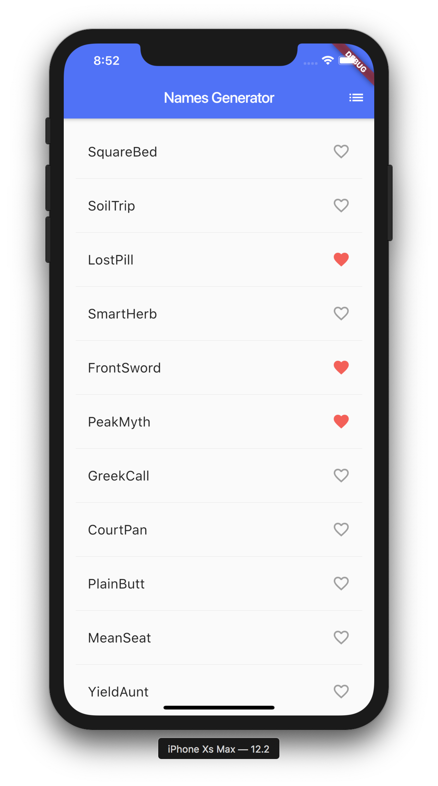

# Flutter app: Names Generator

A simple Flutter project for generating random names.

Based on codelabs tutorial:

- [Write Your First Flutter App, part 1](https://codelabs.developers.google.com/codelabs/first-flutter-app-pt1)
- [Write Your First Flutter App, part 2](https://codelabs.developers.google.com/codelabs/first-flutter-app-pt2)

## Getting Started

For help getting started with Flutter, view our
[online documentation](https://flutter.dev/docs), which offers tutorials, samples, guidance on mobile development, and a full API reference.
